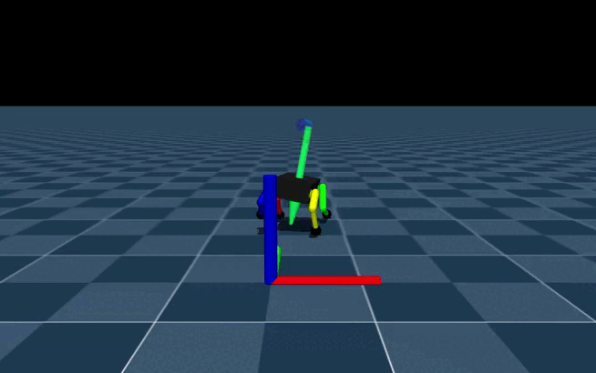
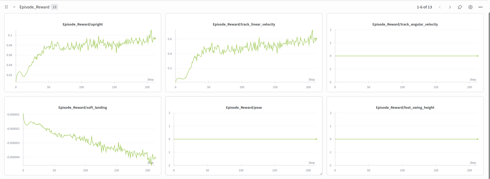

# 🐕 Custom Quadruped RL Controller (MJLab)

Reinforcement Learning (RL) simulation and training project for a custom 3D-printed quadruped robot. The environment is built on **MuJoCo** using the GPU-accelerated **mjlab** framework.

### 🏃‍♂️ Locomotion Demo
**Robot Locomotion Demo**  



**WandB Reward Statistics**


---

## ⚠️ Experimental Reward Shaping
The project is currently in an active **Reward Shaping** phase.

We are iterating on environment reward weights to avoid "local minima" (such as the robot remaining static to maximize the "upright" bonus) and to encourage forward exploration. The current configuration penalizes torso instability while providing significant incentives for achieving target linear velocity (1.0 m/s). Foot clearance and swing height penalties are temporarily suppressed to facilitate the initial gait (trot) emergence.

## ⚙️ Physical Model Specifications (Sim-to-Real)
The `quadruped_robot.xml` and its constants are rigorously modeled after our physical hardware to ensure a clean Sim-to-Real transfer:

*   **Total Mass:** 2.5 kg.
*   **Kinematics:** 12 DoF. Actuators are concentrated in the hips, utilizing rod-linkage transmissions for the knee (KFE) joints to minimize leg inertia.
*   **Actuators (270° Servos):** Modeled as DC motors with internal PD controllers.
    *   **Stall Torque:** ~2.45 N·m (25 kg·cm).
    *   **Dynamic Loss:** Implemented via an experimental *Damping* factor to simulate torque degradation at high speeds under load.

## 🚀 How to Run

Ensure you have the `uv` package manager installed.

**1. Install all the dependencies**
```bash
uv sync
```
**2. Train and play**